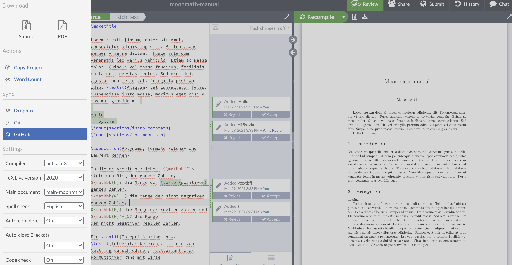
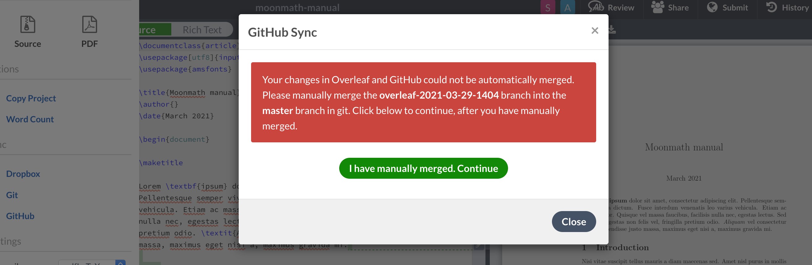

This repo contains the files needed to typeset the MoonMath Manual in LaTeX. Other relevant docs:

-     The planning document with meeting notes can be found [here](https://docs.google.com/document/d/1FrWroya2MWgugYa_44lgdfgy9KD4wXAXhgQWzwHaEl8/edit) (you need to be in the `team@leastauthority.com` Google Group to have access).
-     The document for collecting links to sources for content and inspiration for formatting is [here](moonmath-links.md).

## Folder structure

The main `.tex` file is `main-moonmath.tex`. This should only be used for formatting and front/back matter.

The actual content of the chapters is stored in the folder `chapters`. Each chapter should have its own `.tex` file. Please use the following naming convention for these: `[content]-moonmath.tex `; e.g. `intro-moonmath.tex`, `zoo-moonmath.tex`, etc.

Pre-compiled figures, graphics, logos, etc. should be stored in the `figures` folder. We can split these further if it becomes too messy. Please use a descriptive name for all graphic files. For consistency, use all lowercase letters in the names, with hyphens separating the words, e.g. `overleaf-github-menu.png`.

## Git workflow

Given the small number of contributors, the fact that we're mostly working with text files, and the limitations of [Overleaf integration](#overleaf-integration), we'll use a very minimal workflow with very few branches. This means that you should push to `master` in most cases, and only create a new branch if you're making breaking changes or likely to create a lot of merge conflicts.

## Overleaf intergration

To facilitate collaboration with people using a WYSIWYG editor, we have an [Overleaf project for the MoonMath manual](https://www.overleaf.com/project/6061b4073b270f74b95100ad). This project is connected to the GitHub repo, but it has to be manually synced with it.

To do this, open the Overleaf project in your browser, click **Menu** in the upper left corner, then click **GitHub**. 

You will be able to pull changes from GitHub to Overleaf, or push Overleaf changes to GitHub.

> WARNING: Overleaf is not great at handling branches in GitHub, so it's safest to merge and delete feature branches before syncing with Overleaf.

In the best case scenario, Overleaf disregards non-`master` branches, but sometimes having a feature branch open in GitHub produces an error when trying to sync with Overleaf.

